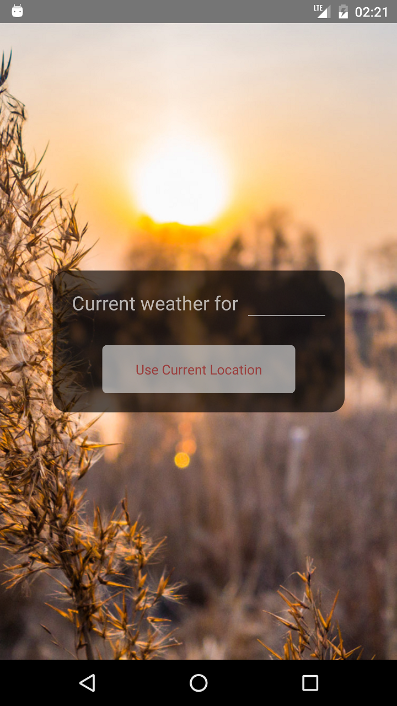
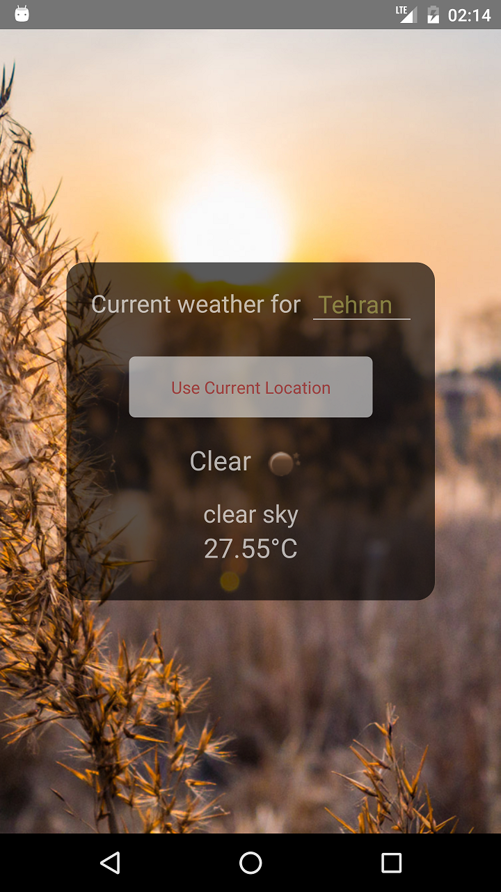

# Weather app
a simple android and ios Weather App
- react-native
- android build tools 28.0.3 (android 9)
- [Open Weather Map Api](http://www.openweathermap.com)

you can fetch weather by typing city names or using  
"Use Current Location" button that uses your location

    
    

